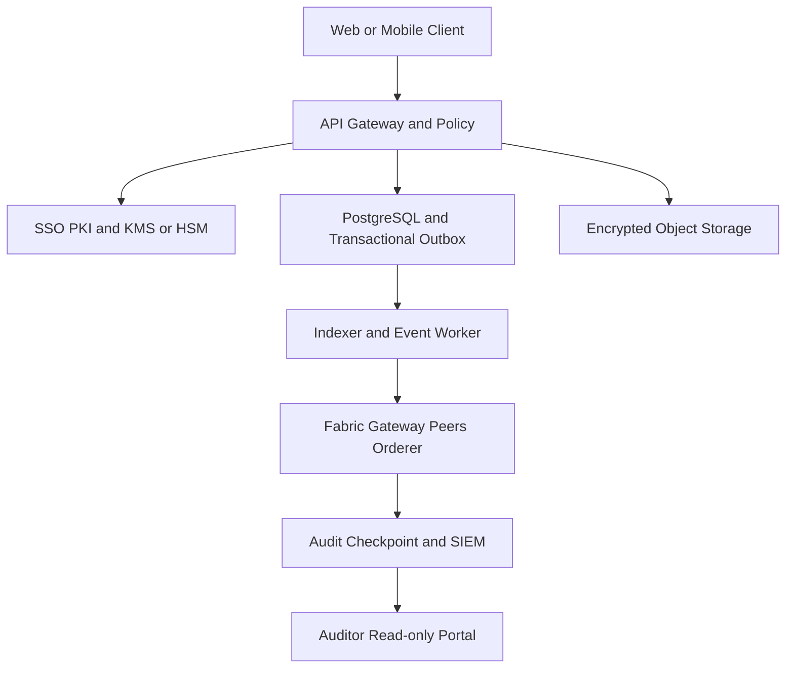

# PRD — Hybrid PQC Permissioned Transaction & Supply Chain Ledger

**Versi:** 0.1 — Draft untuk discovery dan security review
**Status:** Draft
**Target:** Aplikasi internal kantor untuk pencatatan transaksi, approval, aset, serah-terima, procurement, dan logistik
**Prinsip utama:** blockchain menjadi lapisan kepercayaan dan audit; database tetap menjadi sistem operasional; data sensitif dan dokumen disimpan off-chain.

## 1. Ringkasan eksekutif

Produk ini adalah aplikasi internal multi-organisasi untuk mencatat kejadian bisnis yang membutuhkan riwayat dapat diverifikasi: pengajuan transaksi, pemeriksaan, persetujuan, pembelian, penerimaan barang, perpindahan aset, serah-terima, dan penyelesaian.

Fondasinya adalah **permissioned blockchain Hyperledger Fabric** dengan private data collection seperlunya, PostgreSQL sebagai operational database/read model, object storage terenkripsi untuk dokumen, dan audit service untuk verifikasi independen.

Lapisan kriptografi memakai pendekatan bertahap:

- tanda tangan hybrid: ECDSA atau Ed25519 yang sudah digunakan organisasi + ML-DSA-65;
- pertukaran kunci hybrid: X25519 atau P-256 + ML-KEM-768;
- enkripsi data: AES-256-GCM dengan envelope encryption melalui KMS/HSM;
- crypto-agility agar algoritma dapat diganti tanpa migrasi besar-besaran;
- fase awal boleh hybrid, dengan target migrasi bertahap menuju post-quantum penuh ketika ekosistem, sertifikat, library, dan kebijakan organisasi siap.

Produk ini **bukan** cryptocurrency, public blockchain, atau pengganti penuh ERP/finance system.

## 2. Tujuan dan non-tujuan

### Tujuan

1. Menyediakan satu riwayat transaksi dan perpindahan aset yang konsisten antar unit atau organisasi.
2. Membuktikan siapa yang mengajukan, memeriksa, menyetujui, dan melakukan serah-terima.
3. Mencegah penghapusan atau perubahan riwayat tanpa jejak.
4. Menjaga kerahasiaan dengan prinsip least privilege, private collections, dan penyimpanan off-chain.
5. Menyiapkan perlindungan terhadap risiko komputasi kuantum melalui hybrid cryptography.
6. Memudahkan auditor memverifikasi transaksi melalui node atau checkpoint yang independen.
7. Menyediakan API agar dapat diintegrasikan dengan ERP, HR/SSO, procurement, warehouse, dan sistem pelaporan.

### Non-tujuan

- Menerbitkan token atau uang digital.
- Menyimpan dokumen rahasia, data pribadi lengkap, data perbankan, atau data besar langsung di ledger.
- Menggantikan ERP, sistem akuntansi, atau WMS secara menyeluruh pada fase pertama.
- Menganggap blockchain otomatis memenuhi persyaratan hukum tanda tangan elektronik.
- Mengklaim sistem sudah "full post-quantum" hanya karena memakai satu algoritma PQC.
- Menyalin konfigurasi test network ke produksi.

## 3. Prinsip desain wajib

| Prinsip | Keputusan desain |
|---|---|
| Privacy by design | Ledger menyimpan metadata minimum, hash, status, dan bukti; dokumen berada di object storage terenkripsi. |
| Least privilege | Akses ditentukan oleh organisasi, peran, jenis transaksi, dan kebutuhan untuk mengetahui. |
| Fail closed | Tanda tangan hybrid, policy, sertifikat, atau status revocation yang tidak valid menyebabkan transaksi ditolak. |
| Append-only | Koreksi dibuat sebagai compensating event atau superseding event, bukan mengubah event lama. |
| Crypto-agility | Semua signature dan key envelope menyimpan `algorithm_suite`, versi, key ID, dan parameter. |
| Separation of duties | Admin aplikasi, operator node, pemegang kunci, approver, dan auditor dipisah. |
| Defense in depth | Keamanan tidak bergantung pada blockchain saja: SSO, mTLS, KMS/HSM, database controls, SIEM, backup, dan review tetap wajib. |
| Reproducible delivery | Dependency dikunci, image ditandatangani, SBOM dibuat, dan perubahan melalui review. |

## 4. Pengguna, organisasi, dan peran

| Aktor | Tanggung jawab | Hak utama |
|---|---|---|
| Requester | Membuat pengajuan transaksi atau permintaan barang | Create draft, upload referensi, melihat transaksi miliknya |
| Verifier | Memeriksa kelengkapan dan validitas | Verify, reject, request correction |
| Approver | Memberi persetujuan sesuai limit dan kewenangan | Approve atau reject; tidak boleh menyetujui pengajuannya sendiri |
| Warehouse/logistics operator | Mencatat penerimaan, perpindahan, dan serah-terima | Scan asset, create custody event, confirm handover |
| Vendor/partner | Mengirim data yang diizinkan dan mengonfirmasi serah-terima | Limited portal/API access; hanya data terkait |
| Auditor | Melakukan verifikasi independen | Read-only, export proof, verify hash/signature/checkpoint |
| Application admin | Mengelola konfigurasi aplikasi | Tidak boleh membaca private key atau melewati approval policy |
| Node operator | Menjaga peer/orderer/observability | Tidak boleh mengubah business record atau menyetujui transaksi |
| Security/KMS operator | Mengelola kunci, revocation, dan key ceremony | Akses terkontrol ke HSM/KMS; tidak mengelola approval bisnis |
| Data owner | Menentukan klasifikasi, retensi, dan kebutuhan akses | Policy approval dan data governance |

## 5. Proses bisnis utama

### 5.1 Transaksi pengadaan atau administrasi

1. Requester mengisi transaksi dan memilih jenis workflow.
2. API memvalidasi schema, otorisasi, limit, idempotency key, dan klasifikasi data.
3. Dokumen diunggah ke object storage terenkripsi; aplikasi menyimpan hash dokumen dan metadata referensi.
4. Payload dinormalisasi secara canonical agar semua pihak menghitung hash yang sama.
5. Requester menandatangani transaction envelope dengan signature klasik dan ML-DSA-65.
6. PostgreSQL menyimpan status lokal dan transactional outbox dalam satu transaksi database.
7. Worker mengirim event ke Fabric Gateway.
8. Peer melakukan endorsement berdasarkan policy organisasi dan jenis transaksi.
9. Orderer mengurutkan transaksi; peer melakukan validation dan commit.
10. Event listener menerima commit event, memvalidasi idempotency, lalu memperbarui read model.
11. Approver melakukan pemeriksaan dan tanda tangan sesuai pemisahan tugas.
12. Setelah seluruh approval dan bukti serah-terima lengkap, transaksi berubah menjadi `SETTLED`.
13. Auditor dapat memeriksa signature, hash dokumen, urutan event, dan checkpoint tanpa mempercayai satu admin aplikasi.

### 5.2 Lifecycle aset dan logistik

`CREATED → RECEIVED → INSPECTED → STORED → ISSUED → TRANSFERRED → MAINTENANCE → RETURNED → RETIRED`

Setiap perubahan custody minimal memuat:

- `asset_id` dan serial atau tag internal;
- pihak pengirim dan penerima;
- lokasi atau zona, bukan koordinat sensitif jika tidak diperlukan;
- waktu event dari server tepercaya;
- kondisi dan hasil inspeksi;
- referensi dokumen atau foto yang tersimpan off-chain;
- tanda tangan pihak yang menyerahkan dan menerima;
- hash event sebelumnya untuk menjaga urutan.

Status transaksi yang disarankan:

`DRAFT`, `VERIFIED`, `ENDORSED`, `COMMITTED`, `SETTLED`, `REJECTED`, `CANCELLED`, `SUPERSEDED`, `REVOKED`.

## 6. Arsitektur target



### Komponen

| Komponen | Fungsi | Catatan keamanan |
|---|---|---|
| Client | Form, approval, scan asset, verifikasi receipt | Tidak menyimpan private key mentah; gunakan secure key store atau signing service. |
| API gateway | Authentication, rate limit, schema validation, idempotency | Tidak boleh menjadi satu-satunya audit source. |
| Policy service | RBAC/ABAC, approval matrix, separation of duties | Semua keputusan policy diberi `policy_version`. |
| PostgreSQL | Operational state, read model, search, workflow | Encrypted, private subnet, PITR, audit log, restricted admin. |
| Object storage | Dokumen, foto, lampiran | Envelope encryption, retention, object lock bila diperlukan. |
| Fabric network | Shared commit log, endorsement, private collections | Node antar organisasi dipisah dan tidak diekspos langsung ke internet. |
| Event worker | Commit event ke read model dan notifikasi | Idempotent, retry dengan backoff, dead-letter queue. |
| Audit service | Hash verification, signature verification, checkpoints | Dapat dijalankan oleh domain auditor yang terpisah. |
| KMS/HSM | Key generation, signing, wrapping, rotation | Private key tidak masuk PostgreSQL, log, source code, atau image. |
| SIEM/monitoring | Deteksi anomali dan incident response | Alert untuk downgrade, signature failure, key revocation, dan node lag. |

### Pembagian data on-chain dan off-chain

| Data | Lokasi | Alasan |
|---|---|---|
| Transaction ID, event type, status, timestamp server | Ledger + read model | Dibutuhkan untuk audit dan ordering. |
| Payload hash dan previous event hash | Ledger + read model | Bukti integritas tanpa membuka isi. |
| Signature envelope dan key ID | Ledger, dengan metadata minimum | Memungkinkan verifikasi dan migrasi algoritma. |
| Approval decision dan policy version | Ledger | Bukti keputusan dan aturan yang dipakai. |
| Dokumen, kontrak, foto, lampiran besar | Object storage terenkripsi | Lebih mudah dikontrol akses, retensi, dan backup. |
| PII, data banking, data rahasia/terklasifikasi | Sistem khusus sesuai klasifikasi | Tidak boleh dimasukkan ke ledger pada MVP. |
| Search index dan dashboard materialized view | PostgreSQL/search service | Kinerja aplikasi dan pelaporan. |

## 7. Model data inti

Entitas minimum:

- `organization`
- `user_identity`
- `role_assignment`
- `certificate_metadata`
- `key_reference`
- `transaction`
- `transaction_event`
- `approval`
- `asset`
- `custody_event`
- `document_reference`
- `outbox_event`
- `audit_checkpoint`
- `revocation_record`
- `security_event`
- `policy_definition`

Contoh envelope yang dapat direkam di ledger. Isinya harus disesuaikan dengan klasifikasi data:

```json
{
  "transaction_id": "txn_01H...",
  "schema_version": "transaction.v1",
  "organization_id": "org-a",
  "actor_id": "actor-reference-only",
  "event_type": "ASSET_HANDOVER_CONFIRMED",
  "asset_id": "asset-123",
  "event_sequence": 4,
  "previous_event_hash": "sha256:...",
  "payload_hash": "sha256:...",
  "idempotency_key": "idem-...",
  "algorithm_suite": "HYBRID_ECDSA_MLDSA65_V1",
  "classical_key_id": "kid-classical-...",
  "pqc_key_id": "kid-pqc-...",
  "classical_signature": "base64:...",
  "pqc_signature": "base64:...",
  "created_at_server": "2026-09-17T12:00:00Z",
  "expires_at": "2026-09-24T12:00:00Z",
  "policy_version": "handover-policy.v3"
}
```

Aturan penting:

- `actor_id` pada ledger tidak boleh menjadi PII lengkap bila pseudonymous reference cukup.
- Signature context harus mencakup domain aplikasi, environment, transaction type, schema version, dan transaction ID untuk mencegah cross-protocol signing.
- Event yang sama tidak boleh dapat di-commit dua kali; gunakan unique constraint dan validasi ledger.
- Koreksi direpresentasikan dengan event baru yang merujuk event lama.
- Private key hanya direferensikan melalui `key_id`; material kunci tidak pernah masuk payload.

## 8. Kebutuhan fungsional

| ID | Kebutuhan | Acceptance criteria tingkat tinggi |
|---|---|---|
| FR-001 | SSO dan identity federation | Login, MFA, organisasi, role, dan session policy dapat dikontrol terpusat. |
| FR-002 | Create transaction | Draft tervalidasi schema, klasifikasi, limit, dan idempotency. |
| FR-003 | Approval workflow | Approval matrix dapat dikonfigurasi; self-approval ditolak. |
| FR-004 | Hybrid signing | Event hanya diterima jika signature suite dan key status valid. |
| FR-005 | Asset registry | Aset memiliki lifecycle dan custody history yang dapat diverifikasi. |
| FR-006 | Document reference | Dokumen di-encrypt off-chain; hash dapat diverifikasi terhadap event. |
| FR-007 | Fabric commit | Commit status hanya diterbitkan setelah commit event tervalidasi. |
| FR-008 | Private data | Data terbatas hanya dapat dibaca oleh organisasi/collection yang berwenang. |
| FR-009 | Event indexing | Event listener idempotent dan dapat mengejar event setelah downtime. |
| FR-010 | Audit verification | Auditor dapat memverifikasi chain of events, signature, dan checkpoint. |
| FR-011 | Search/reporting | Search membaca read model, bukan query langsung ke ledger untuk kebutuhan rutin. |
| FR-012 | Integration API | ERP/WMS/SSO dapat terhubung melalui versioned API dan webhook. |
| FR-013 | Revocation | Certificate/key yang dicabut tidak dapat dipakai membuat event baru. |
| FR-014 | Export proof | Sistem dapat menghasilkan verification receipt tanpa membocorkan data yang tidak berwenang. |
| FR-015 | Incident workflow | Event security dapat ditandai, diinvestigasi, dan dikaitkan dengan corrective event. |

## 9. Kebutuhan non-fungsional

### Keamanan

- TLS 1.3 untuk semua koneksi; gunakan hybrid key exchange pada jalur yang sudah mendukungnya.
- Setiap endpoint memiliki authentication, authorization, input validation, rate limit, dan audit event.
- Database, backup, object storage, dan queue dienkripsi saat tersimpan.
- Secret tidak boleh berada di repository, image, log, atau environment yang tidak terlindungi.
- Admin memakai MFA dan akses just-in-time bila platform mendukung.
- Semua perubahan konfigurasi produksi melalui change review dan approval.
- Dependency memakai versi terkunci, SBOM, vulnerability scan, secret scan, SAST, DAST, dan container scan.

### Keandalan dan operasi

- Transactional outbox mencegah transaksi database sukses tetapi event ledger hilang.
- Consumer event bersifat idempotent dan memiliki dead-letter queue.
- Backup terenkripsi, immutable bila sesuai kebijakan, dan diuji restore secara berkala.
- Recovery Point Objective dan Recovery Time Objective ditentukan sebelum produksi.
- Clock synchronization, certificate expiry, node lag, checkpoint mismatch, dan queue backlog dimonitor.

### Kinerja

Target angka harus ditentukan melalui benchmark lingkungan kantor. MVP wajib mengukur:

- waktu dari submit sampai commit;
- throughput transaksi per jenis workflow;
- ukuran transaction envelope dengan signature hybrid;
- waktu verifikasi batch oleh auditor;
- pemulihan indexer setelah kehilangan koneksi;
- dampak private collection dan object storage.

Jangan menjadikan angka dari test network sebagai SLA produksi.

## 10. Threat model dan kontrol

| Ancaman | Dampak | Kontrol wajib |
|---|---|---|
| Admin database mengubah read model | Laporan palsu | Ledger verification, audit checkpoint, append-only security log, independent auditor. |
| User dicuri kredensialnya | Pengajuan tidak sah | MFA, device/session policy, approval separation, anomaly detection, key revocation. |
| Replay atau duplikasi event | Double settlement | Nonce, idempotency key, unique constraint, event sequence, expiry, previous hash. |
| Downgrade dari hybrid ke klasik | Perlindungan PQC hilang | Negotiation policy terautentikasi, minimum suite per data class, alert dan fail closed. |
| Private key bocor | Pemalsuan signature | HSM/KMS, non-exportable key, rotation, revocation, key ceremony, dual control. |
| Peer atau node disusupi | Gangguan atau kebocoran | Network segmentation, private collections, peer isolation, endorsement policy, monitoring. |
| Data rahasia masuk ledger | Pelanggaran kerahasiaan/retensi | Data classification gate, payload allowlist, DLP rule, code review, privacy test. |
| Event listener kehilangan event | Read model tidak konsisten | Replayable events, checkpoint consumer, outbox, reconciliation job. |
| Dependency berbahaya | Supply-chain compromise | Pin version, SBOM, signed artifacts, provenance, SCA, isolated build. |
| DoS atau flooding | Layanan tidak tersedia | Rate limit, queue limit, circuit breaker, node/API isolation, capacity test. |
| Insider berkolusi | Approval palsu | Multi-party endorsement, separation of duties, independent audit, anomaly alerts. |

### Catatan khusus post-quantum

1. **ML-KEM adalah mekanisme key encapsulation, bukan tanda tangan.** Karena itu pertukaran kunci dan signature membutuhkan desain terpisah.
2. **Hybrid TLS tidak otomatis membuat sertifikat atau signature menjadi post-quantum.** Status PQ harus ditentukan per jalur komunikasi dan per bukti tanda tangan.
3. Signature PQC cenderung lebih besar; block size, bandwidth, database index, dan latency wajib diuji.
4. Format `algorithm_suite` harus mencegah downgrade dan mendukung migrasi key ID serta signature baru.
5. Implementasi kriptografi tingkat tinggi harus memakai library yang diaudit dan sesuai kebijakan organisasi; jangan mengimplementasikan primitive sendiri.

## 11. Rekomendasi pemanfaatan GitHub

Repositori berikut digunakan sebagai referensi, sample, atau komponen opsional. Tidak ada sample repository yang boleh langsung dianggap production-ready tanpa security review, hardening, dan pengujian sesuai lingkungan kantor.

| Repository | Peran dalam proyek | Cara pakai | Batasan |
|---|---|---|---|
| [hyperledger/fabric-samples](https://github.com/hyperledger/fabric-samples) | Fondasi pembelajaran dan bootstrap lokal | Pelajari struktur network, chaincode, gateway, policy, dan lifecycle chaincode. | Test network bukan deployment produksi; ganti identity, topology, secrets, monitoring, dan HA. |
| [asset-transfer-basic](https://github.com/hyperledger/fabric-samples/tree/main/asset-transfer-basic) | Contoh lifecycle aset | Ambil pola CRUD/lifecycle lalu ubah menjadi domain transaction dan custody event. | Jangan menyalin model aset sederhana, access control, atau konfigurasi sample tanpa review. |
| [asset-transfer-private-data](https://github.com/hyperledger/fabric-samples/tree/main/asset-transfer-private-data) | Referensi privacy antar organisasi | Gunakan pola collection, transient data, hash, dan policy akses. | Private collection bukan pengganti klasifikasi data, encryption, dan governance. |
| [asset-transfer-events](https://github.com/hyperledger/fabric-samples/tree/main/asset-transfer-events) | Referensi event-driven integration | Jadikan dasar listener yang mengisi read model, notifikasi, dan reconciliation. | Listener harus ditambah idempotency, replay, checkpoint, retry, dan observability. |
| [Ashish-Barmaiya/attest](https://github.com/Ashish-Barmaiya/attest) | Inspirasi audit hash-chain dan external anchoring | Pelajari konsep `payloadHash`, `prevChainHash`, chain head, verification, dan checkpoint. | Perlakukan sebagai referensi pihak ketiga/prototipe; audit license, kode, dependency, dan threat model sebelum adaptasi. |
| [hyperledger/firefly](https://github.com/hyperledger/firefly) | Opsional untuk integration/API layer multi-network | Pertimbangkan setelah core ledger stabil dan kebutuhan token/data flow lintas jaringan jelas. | Bukan pengganti Fabric security model; menambah kompleksitas operasi dan dependency. |
| [hyperledger/besu](https://github.com/hyperledger/besu) | Alternatif bila ada kebutuhan EVM/Solidity | Evaluasi hanya jika compatibility dengan EVM menjadi requirement nyata. | Bukan pilihan utama untuk MVP Fabric-based; jangan menjalankan dua stack tanpa alasan bisnis. |

### Aturan pengambilan kode

1. Pin ke release atau commit yang disetujui, bukan `main` tanpa kontrol.
2. Simpan attribution dan license notice.
3. Buat fork/vendor mirror internal agar build dapat direproduksi.
4. Jalankan SCA, SBOM, secret scan, SAST, dan dependency review sebelum masuk branch produk.
5. Dokumentasikan perubahan lokal dan rencana menarik security fixes dari upstream.
6. Jangan menggabungkan Fabric samples, FireFly, dan Besu sekaligus pada MVP tanpa keputusan arsitektur yang terdokumentasi.

## 12. Rencana MVP

### Scope MVP

Pilot dibatasi pada data administrasi/procurement non-rahasia dengan skenario:

- satu kantor pusat;
- satu unit kerja atau organisasi mitra;
- satu warehouse atau titik serah-terima;
- satu alur pengadaan atau handover aset;
- satu portal auditor read-only;
- satu jaringan Fabric permissioned dengan private data seperlunya;
- PostgreSQL, encrypted object storage, event indexer, dan audit checkpoint.

### Tidak masuk MVP

- dokumen terklasifikasi atau rahasia;
- integrasi penuh ke seluruh ERP/finance;
- public blockchain atau token;
- mobile offline yang menyimpan private key tanpa threat model khusus;
- klaim full PQC pada semua sertifikat, browser, gateway, dan perangkat;
- automatic legal signing tanpa review hukum dan PKI organisasi.

### Acceptance criteria MVP

- Event tanpa signature hybrid yang valid tidak dapat di-commit.
- Tanda tangan yang dicabut, expired, atau salah konteks ditolak.
- Duplicate `idempotency_key` tidak menghasilkan settlement kedua.
- Dokumen dapat diambil hanya oleh role berwenang dan hash-nya cocok dengan event.
- Auditor dapat memverifikasi transaksi dari node/checkpoint independen.
- Payload test yang berisi PII atau secret ditolak oleh validation gate.
- Indexer dapat recovery dan mengejar commit event setelah downtime.
- Backup dapat direstore dalam lingkungan uji yang terisolasi.
- Hasil SAST, SCA, secret scan, threat model review, dan penetration test tidak memiliki temuan kritis yang belum dimitigasi.

## 13. Roadmap implementasi

### Fase 0 — Discovery dan security baseline

- Tetapkan klasifikasi data dan batas use case.
- Petakan organisasi, node owner, approver, auditor, dan operator kunci.
- Finalisasi threat model, RPO/RTO, retention, dan kebutuhan legal.
- Buat keputusan arsitektur: Fabric-first, PostgreSQL off-chain, object storage, dan identity provider.

### Fase 1 — Technical spike

- Jalankan Fabric samples secara lokal.
- Buat chaincode minimal untuk transaction event dan asset custody.
- Implementasikan API, PostgreSQL outbox, event listener, dan verification receipt.
- Benchmark ukuran signature dan waktu commit.

### Fase 2 — MVP internal

- Tambahkan SSO/MFA, approval matrix, private collections, encrypted storage, audit portal, dan SIEM integration.
- Implementasikan crypto-agility envelope dan key lifecycle.
- Jalankan security testing serta tabletop incident response.

### Fase 3 — Pilot multi-organisasi

- Onboard node dan identitas organisasi pilot.
- Uji private data, endorsement, revocation, backup/restore, reconciliation, dan operational runbook.
- Ukur SLA dan beban aktual.

### Fase 4 — Production hardening

- HA topology, HSM/KMS production, immutable backup, signed deployment, DR site, patch cadence, dan independent audit.
- Integrasi ERP/WMS setelah data contract stabil.

### Fase 5 — Migrasi PQC bertahap

- Aktifkan hybrid key exchange di jalur yang kompatibel.
- Perluas hybrid signature ke seluruh transaction class.
- Migrasikan certificate/identity stack yang mendukung PQC.
- Sediakan algorithm deprecation dan key migration procedure.

## 14. Deployment dan operasi produksi

- Pisahkan environment development, staging, dan production.
- Peer, orderer, API, database, KMS, object storage, dan monitoring berada pada trust zone yang berbeda.
- Tidak ada peer/orderer yang diekspos langsung ke internet publik.
- Jalur admin dipisahkan dari jalur user dan partner.
- Gunakan mTLS antar service dan policy network yang allowlist.
- HSM/KMS memakai dual control untuk operasi sensitif.
- Setiap deployment memiliki artifact digest, SBOM, approval record, dan rollback plan.
- Patch dan vulnerability response memiliki owner serta target waktu yang disepakati.

## 15. Observability dan incident response

### Metrics

- API error rate dan latency;
- transaction submitted/endorsed/committed/rejected;
- endorsement failure;
- duplicate/replay detection;
- event consumer lag dan dead-letter count;
- signature verification failure;
- key/certificate expiry dan revocation;
- node availability, block lag, storage growth;
- checkpoint mismatch;
- private collection access anomaly.

### Event yang harus di-alert

- percobaan downgrade algorithm suite;
- signature gagal berulang dari identitas yang sama;
- perubahan policy tanpa change ticket;
- akses object storage di luar pola;
- ketidaksesuaian read model dengan ledger;
- node kehilangan koneksi atau clock skew;
- penggunaan key setelah revocation;
- payload yang melanggar klasifikasi.

### Respons kompromi kunci

1. Suspend key dan identity terkait.
2. Cabut certificate atau tandai key revoked.
3. Identifikasi event yang dibuat key tersebut.
4. Jangan menghapus event historis; buat incident/corrective event.
5. Rotasi key melalui KMS/HSM dan ulangi approval sesuai dual control.
6. Audit dampak, pulihkan akses minimum, dan dokumentasikan root cause.

## 16. Struktur repository produk yang disarankan

```text
company-ledger/
├── api/                 # API contract, auth middleware, input validation
├── web/                 # portal user, approver, auditor
├── chaincode/            # transaction and asset custody contracts
├── network/              # production-shaped templates, not sample secrets
├── indexer/              # commit event consumer and read model
├── audit-service/        # verification, checkpoints, proof export
├── crypto/               # algorithm suite, canonicalization, adapters
├── infra/                # IaC, policy, network segmentation, observability
├── security/             # threat model, SBOM, runbooks, key ceremony
├── tests/                # unit, integration, property, security, recovery
└── docs/                 # ADR, data classification, API and operations guide
```

## 17. Definition of done sebelum produksi

- Product owner menyetujui scope dan data classification.
- Security architect menyetujui threat model dan residual risk.
- Data owner menyetujui retensi, private data, dan akses auditor.
- Key ceremony, revocation, rotation, dan emergency procedure diuji.
- Semua endpoint memiliki authorization test.
- Chaincode memiliki unit, integration, negative, replay, and policy tests.
- Build menghasilkan artifact digest dan SBOM.
- Tidak ada secret di repository, image, log, atau test fixture.
- Penetration test dan dependency review selesai.
- Backup/restore dan disaster recovery test berhasil.
- Operator memiliki runbook untuk node, database, KMS, indexer, dan incident response.
- Pilot berhasil memenuhi acceptance criteria dan benchmark yang disepakati.

## 18. Keputusan yang harus dikonfirmasi kantor

1. Organisasi atau unit apa saja yang akan menjadi peer pada pilot?
2. Apakah kantor sudah memiliki SSO, PKI internal, KMS, atau HSM?
3. Jenis transaksi pertama: procurement, invoice, aset, handover, atau kombinasi terbatas?
4. Sistem existing apa yang menjadi source of truth untuk user, vendor, aset, dan anggaran?
5. Data apa yang diklasifikasikan rahasia, terbatas, atau publik internal?
6. Berapa volume transaksi harian, ukuran lampiran, dan jumlah pengguna?
7. Berapa lama dokumen dan audit proof harus dipertahankan?
8. Apakah tanda tangan aplikasi menjadi bukti internal saja atau harus memenuhi persyaratan hukum tertentu?
9. Siapa pemilik node, auditor independen, dan security incident response?
10. Target RPO, RTO, SLA, serta lokasi deployment yang diperbolehkan?

## 19. Referensi implementasi

- [Hyperledger Fabric Samples](https://github.com/hyperledger/fabric-samples)
- [Fabric asset transfer with private data](https://github.com/hyperledger/fabric-samples/tree/main/asset-transfer-private-data)
- [Fabric asset transfer events](https://github.com/hyperledger/fabric-samples/tree/main/asset-transfer-events)
- [Hyperledger Fabric private data documentation](https://hyperledger-fabric.readthedocs.io/en/latest/private-data/private-data.html)
- [Attest — hash-chain audit reference](https://github.com/Ashish-Barmaiya/attest)
- [Hyperledger FireFly](https://github.com/hyperledger/firefly)
- [Hyperledger Besu](https://github.com/hyperledger/besu)

Referensi GitHub di atas adalah titik awal engineering. Sebelum dipakai dalam produksi, lakukan license review, code review, dependency review, threat modeling, security testing, dan validasi versi yang aktif.
